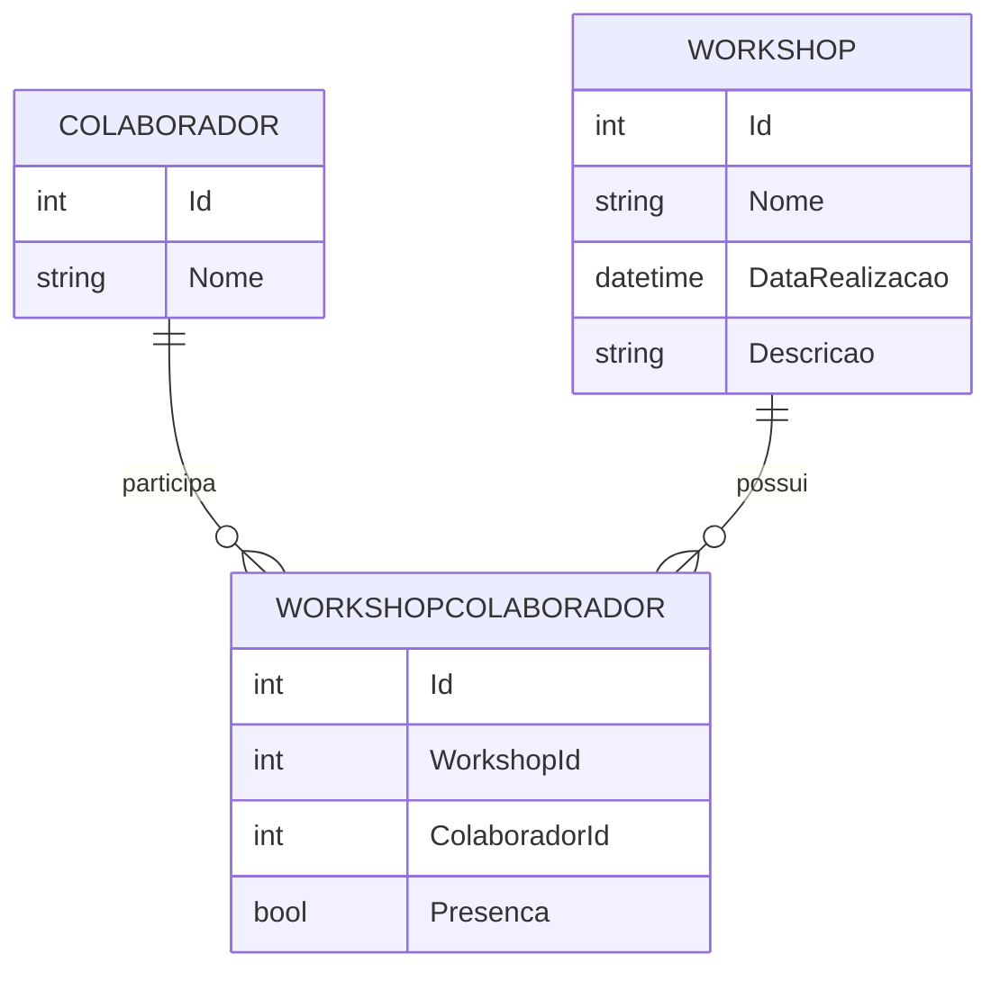
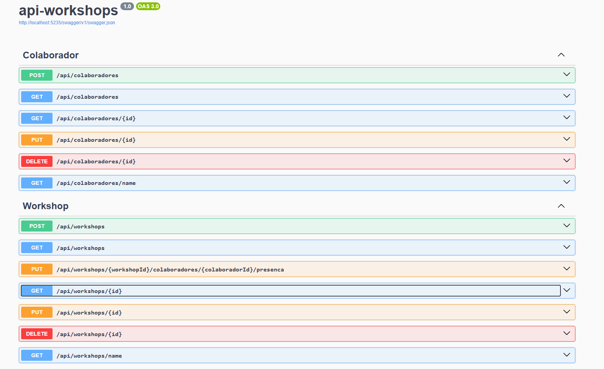

# 📚 API REST de Workshops 📋

Esta API faz parte do projeto **Workshop web**, desenvolvida em **.NET 8** para gerenciar **colaboradores** e **workshops**, permitindo registrar e consultar presenças. O objetivo foi reforçar conhecimentos práticos em **ASP.NET Core**, **Entity Framework Core**, **SQL Server/MySQL** e **arquitetura de APIs REST modernas**.

---

## 📂 Sumário

- [⚒️ Tecnologias utilizadas](#️-tecnologias-utilizadas)
- [🔧 Funcionalidades](#-funcionalidades)
- [🗄️ Database Modeling](#️-database-modeling)
- [🗃️ Configuração da Conexão](#️-configuração-da-conexão)
- 🔍 Fazendo Requisições
  * [👨‍💻 Colaborador](#-gerenciamento-de-colaboradores)
  * [📚 Workshop](#-gerenciamento-de-workshops)
- [🚀 Como Executar o Projeto](#-como-executar-o-projeto)
- [📗 Documentação Swagger](#-documentação-swagger)
- [🚫 Observações](#-observações)

---

## ⚒️ Tecnologias utilizadas

- .NET 8
- ASP.NET Core
- Entity Framework Core
- SQL Server ou MySQL
- Swagger (para documentação da API)
- Git/GitHub

---

## 🔧 Funcionalidades

* **Colaboradores**

  * Criar colaborador
  * Buscar todos os colaboradores
  * Buscar colaborador por id
  * Buscar colaborador por nome
  * Atualizar colaborador
  * Deletar colaborador

* **Workshops**

  * Criar workshop
  * Buscar todos os workshops
  * Buscar workshop por id
  * Buscar workshop por nome
  * Atualizar workshop
  * Deletar workshop
  * Registrar presença de um colaborador em um workshop

---

## 🗄️ Database Modeling



---

## 🗃️ Configuração da Conexão

Configure a connection string em `appsettings.json` ou `appsettings.Development.json`:

```json
{
  "ConnectionStrings": {
    "DefaultConnection": "Server=localhost;Database=WorkshopDB;User Id=seu_usuario;Password=sua_senha;TrustServerCertificate=True;"
  }
}
```

* **Server:**  `localhost`
* **Database:** `WorkshopDB`
* **Usuário:** seu usuário do banco
* **Senha:** sua senha do banco

---

## 🔍 Fazendo Requisições (api/colaboradores)

### 👨‍💻 Gerenciamento de Colaboradores

| Method    | Endpoint                | Ação                                     |
| --------- | ----------------------- | ---------------------------------------- |
| 🟢 POST   | /api/colaboradores      | Cria um colaborador                      |
| 🔵 GET    | /api/colaboradores      | Retorna todos os colaboradores           |
| 🔵 GET    | /api/colaboradores/{id} | Retorna colaborador pelo id              |
| 🔵 GET    | /api/colaboradores/name | Retorna colaboradores pelo nome          |
| 🟠 PUT    | /api/colaboradores/{id} | Atualiza o colaborador do id selecionado |
| 🔴 DELETE | /api/colaboradores/{id} | Deleta o colaborador do id selecionado   |

---

## 🔍 Fazendo Requisições (api/workshops)

### 📚 Gerenciamento de Workshops

| Method    | Endpoint                                                           | Ação                                            |
| --------- | ------------------------------------------------------------------ | ----------------------------------------------- |
| 🟢 POST   | /api/workshops                                                     | Cria um workshop                                |
| 🔵 GET    | /api/workshops                                                     | Retorna todos os workshops                      |
| 🔵 GET    | /api/workshops/{id}                                                | Retorna workshop pelo id                        |
| 🔵 GET    | /api/workshops/name                                                | Retorna workshops pelo nome                     |
| 🟠 PUT    | /api/workshops/{id}                                                | Atualiza workshop do id selecionado             |
| 🔴 DELETE | /api/workshops/{id}                                                | Deleta workshop do id selecionado               |
| 🟠 PUT    | /api/workshops/{workshopId}/colaboradores/{colaboradorId}/presenca | Registra presença do colaborador em um workshop |

---

## 🚀 Como Executar o Projeto:

### 🔧 Pré-requisitos

* [SDK .NET 8](https://dotnet.microsoft.com/pt-br/download/dotnet/8.0)
* SQL Server ou MySQL instalados

1️⃣ Clone o repositório:

```bash
git clone https://github.com/brunopaz8/api-workshops.git
cd workshop-api
```

2️⃣ Restaure pacotes e aplique migrations:

```bash
dotnet restore
dotnet ef database update
```

3️⃣ Execute a API:

```bash
dotnet run
```

A API estará disponível em: `http://localhost:5235`

---

## 📗 Documentação **Swagger**

A API conta com documentação interativa via **Swagger UI**, facilitando testes e visualização dos endpoints. Após iniciar a aplicação, acesse:

🟢 **Swagger UI:** [http://localhost:5235/swagger/index.html](http://localhost:5235/swagger/index.html)




---

## 🚫 Observações

* Configure corretamente a `connectionString` no `appsettings.json`.
* Execute migrations manualmente ao rodar localmente (`dotnet ef database update`).
* Certifique-se de que o banco esteja em execução antes de subir a API.
